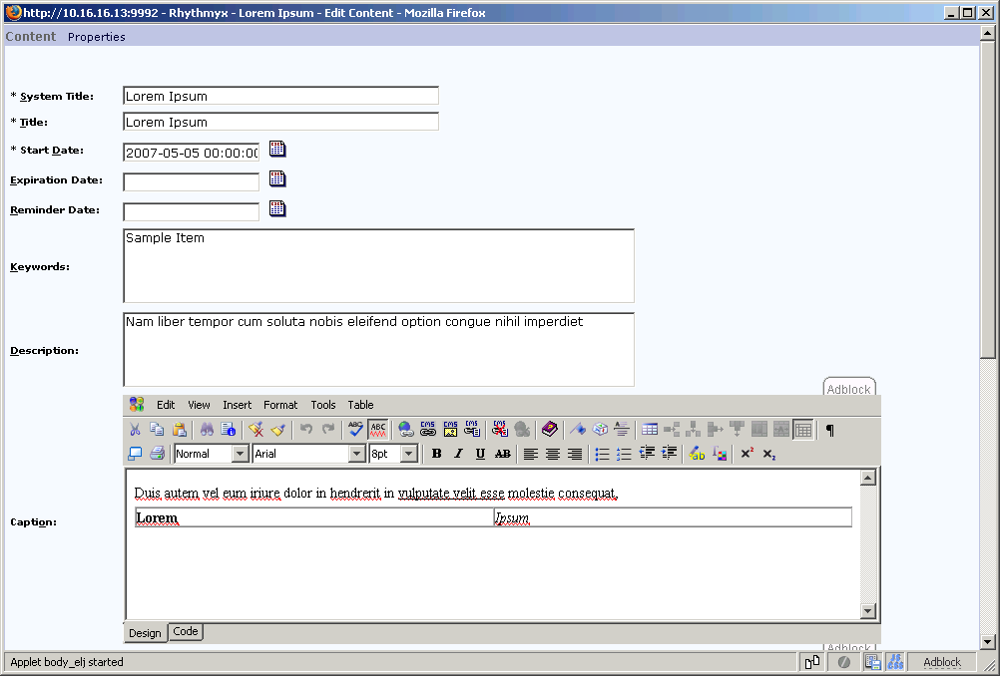
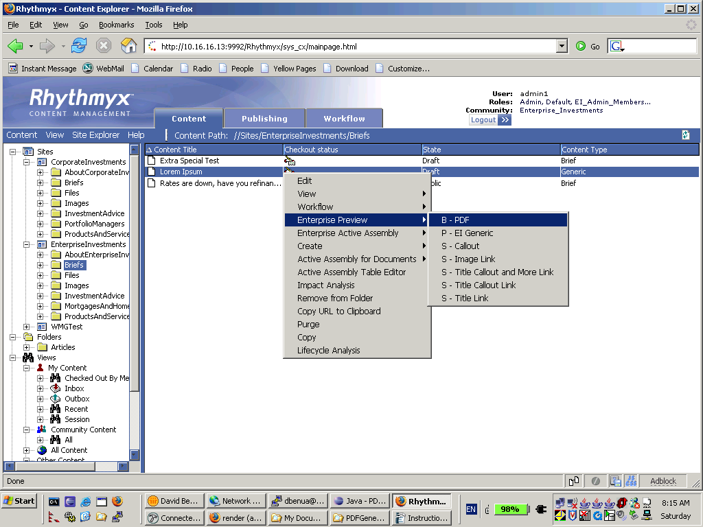
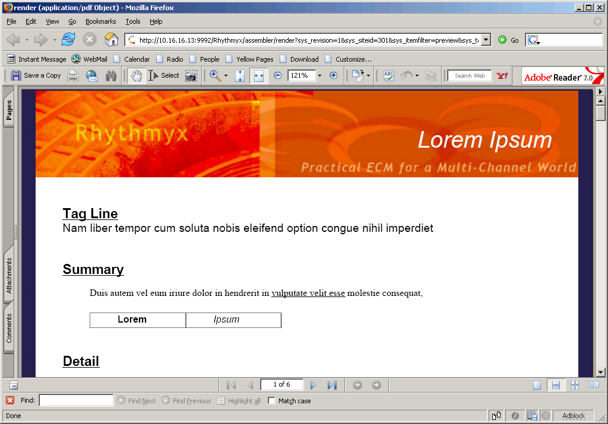
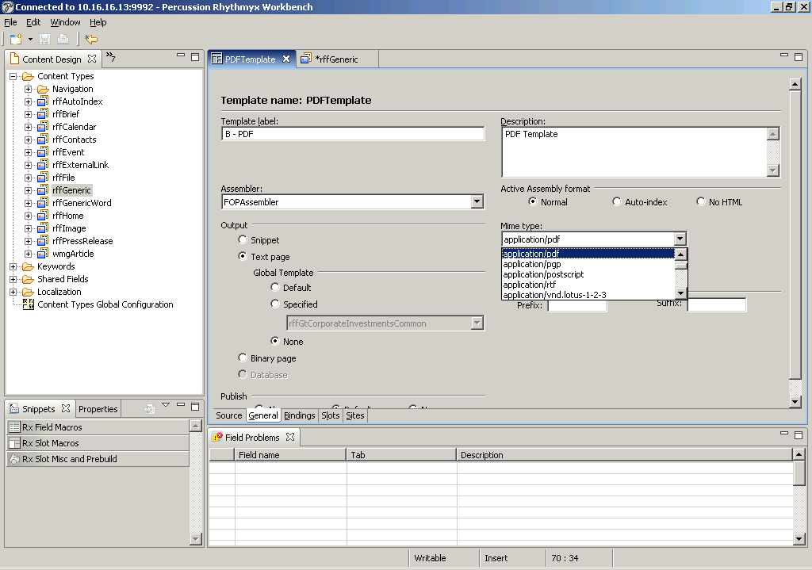
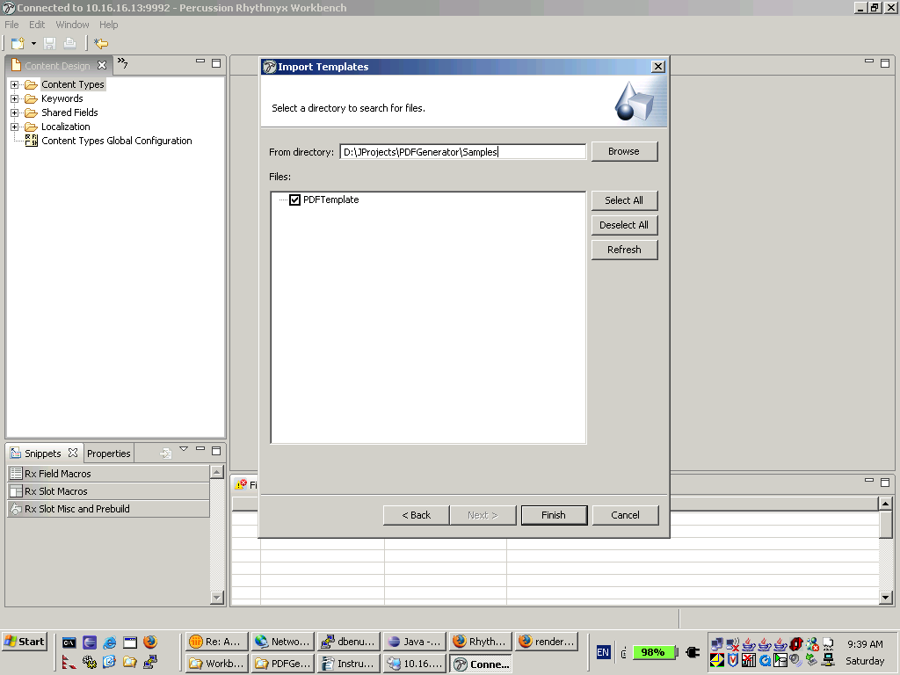
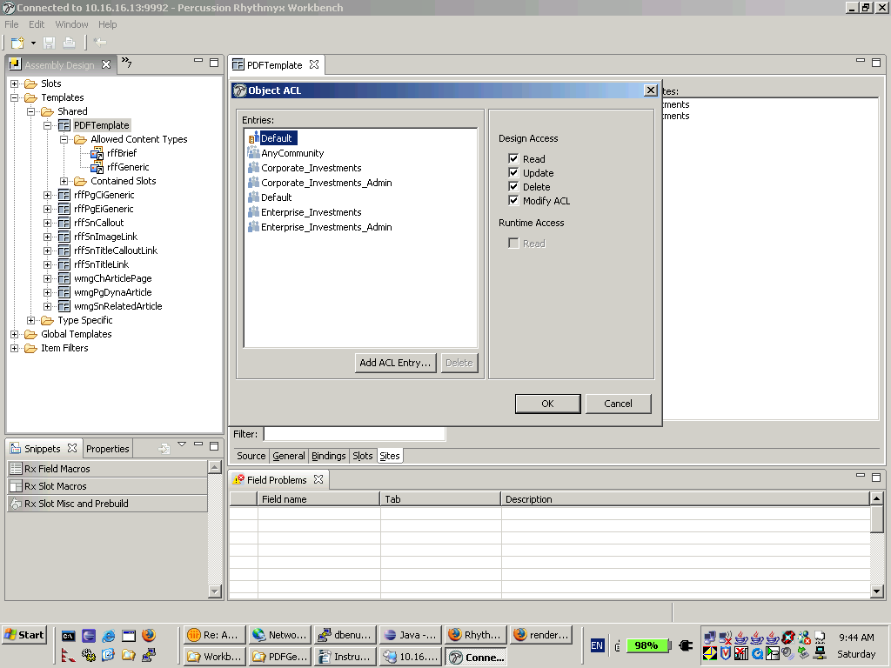
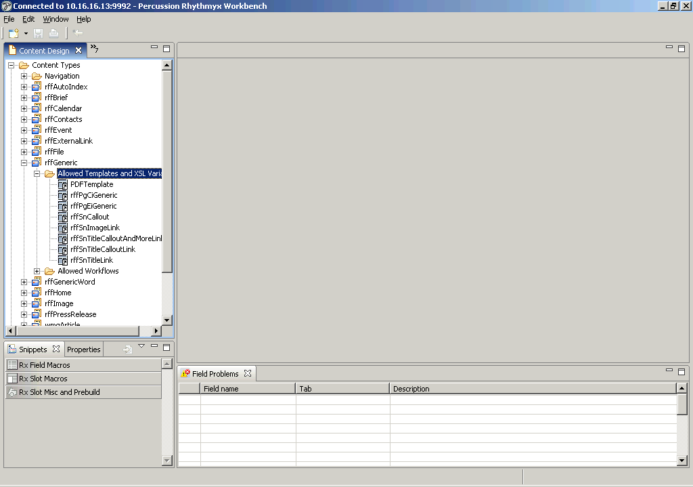
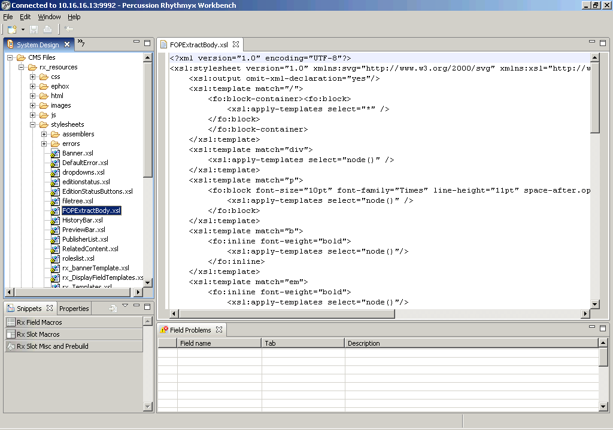

# Rhythmyx FOP Assembler

Welcome to the PSO FOP Assembler.

This project installs an Assembly Plugin that calls the Apache FOP processor.

The FOP Assembler is used to assemble content into PDF, Postscript and other common printable formats, using the Apache FOP processor. The user can create templates that take full advantage of XSL FO without having to write (or debug) large amounts of XSLT.

Contributors use normal Rhythmyx content types, and enter their content using the normal editor controls.  Implementers define one or more FOP Templates that produce the proper output format for that particular content type. Since these are ordinary Rhythmyx templates, multiple templates can be created with different formats as required.

#### Example

We have built a simple example using the Rhythmyx Fast Forward content types.  The contributor enters the content item using the Generic Content Editor.

Using the Content Explorer, the user can then preview the content item with the PDF template.

This results in a PDF displaying on the screen.

## Getting started

### Building the source

*If you just want to install this plugin in Rhythmyx you can skip this section.*

Before you start:

- The `JAVA_HOME` and `RHYTHMYX_HOME` environment variables must be set.
- `RHYTHMYX_HOME` should point to the root of the Rhythmyx installation on your server.
- `JAVA_HOME` should point to the installation directory of the JDK.

Clone the project repository:

`git clone git@github.com:percussion/PSOPDFGenerator.git`

To create a new distribution, run the following command:

- **Linux**: `./gradlew assemble`
- **Windows**: `gradlew assemble`

### Installation

Before you start:

- The `JAVA_HOME` and `RHYTHMYX_HOME` environment variables must be set.
- `RHYTHMYX_HOME` should point to the root of the Rhythmyx installation on your server.
- `JAVA_HOME` should point to the installation directory of the JRE.

*Note: Version 7.+ is installed into the jetty web applcation server included with Rhythmyx. JBOSS is no longer supported.*

Run the following command:

- **Linux**: `./gradlew install`
- **Windows**: `gradlew install`

You will then be able to start your Rhythmyx server and add templates to your existing content types using the new FOP Assembler. Setting the MIME Type of the template will set the output format.

### Adding MIME types to the Workbench

The FOP Assembler as deployed by the deployment script supports the following MIME types:

- application/pdf
- application/postscript
- application/x-pcl
- text/plain
- text/richtext
- text/rtf
- application/rtf
- image/png

The standard Workbench installation does not include all of these types in the **MIME Type** drop down control.

There are 2 files in the Workbench installation that need to be modified. Both of them are named *mimemapwb.properties*. The *Default* properties are located in the Workbench plugin folder:

- **Linux**: `/Rhythmyx/eclipse/plugins/com.percussion.workbench_1.0.0/default-config/rxconfig/Workbench`
- **Windows**: `C:\Rhythmyx\eclipse\plugins\com.percussion.workbench_1.0.0\default-config\rxconfig\Workbench`

The *User* properties are found in the Eclipse Workspace folder:

- **Linux**: `/Rhythmyx/rxconfig/Workbench/users/<username>/workspaces/workspace/.metadata/.plugins/com.percussion.workbench.ui/rxconfig/Workbench`
- **Windows**: `C:\Rhythmyx\rxconfig\Workbench\users\<username>\workspaces\workspace\.metadata\.plugins\com.percussion.workbench.ui\rxconfig\Workbench`

Shut down the Workbench if it is running and edit the files with your favorite text editor. In both files, add the following lines to the edit of the file:

    pdf=application/pdf

    eps=application/postscript

    pcl=application/x-pcl

    rtf=application/rtf

    rtf2=text/rtf

    png=image/png

Restart the Workbench and you should see the new types added to the MIME type dropdown.

## Importing the Sample Templates (Optional)

### PDF Sample

A sample PDF template is included for reference in the *Samples* directory.

Run the following command to install the images and stylesheets:

- **Linux**: `./gradlew deploySamples`
- **Windows**: `gradlew deploySamples`

Open the Workbench and select the **Content Design** view and use the **File – Import** menu to import Templates. Use the **Browse** button to locate the sample *PDFTemplate.template*.

*Note that if you are using 2 different machines, this is relative to the workbench, not the Server.*

Select the **PDFTemplate** entry. Once you press the **Finish** button, the template will appear in the **Assembly Design** view.

You must add your new template to the appropriate Communities.

- Right-click on the template and open the **Security** dialog.
- Add any communities, and check the **Read** box.

You must also add the template to the **Allowed Templates** of any Content Types (in this example **rffGeneric**).

- In the Assembly design view, Select **PDFTemplate** and **Copy** it (with ctrl-C).
- Switch to the **Content Design** view, and expand **Generic**.
- Click on the **Allowed Templates and XSL Variants** and Paste. This will add **PDFTemplate** to the list of allowed templates.

You are now ready to use the sample template.

### PNG Sample

A sample PNG template is included for reference in the *Samples* directory. Install and configure the PNG template using the process described above for the PDF template.

## Extending the Sample Template

### Changing the MIME Type

The sample template is configured to supply PDF output. You can change this by selecting a different type (such as `application/postcript`) and then previewing a Generic content item. Save the output to disk and open it in your favorite text editor.

### Template Source

Examine the template source. You will notice that it returns XML using the FO namespace. Apache and the W3C maintain extensive references and tutorials on FO. We are using FOP version 0.93, but expect that the FOP Assembler will be upward compatible with future versions.

Notice that Static Images can be referenced in the template. Place your images in the *rx_resources* folder.

    <fo:static-content flow-name="xsl-region-before">
        <fo:block>
            <fo:external-graphic src="rx_resources/images/PDFmarginTop.jpg" content-width="20cm"/>
        </fo:block>
    </fo:static-content>

### Bindings

Examine the bindings of the Sample template. You will notice that both the **callout** and **body** fields are processed with **psoTransform**. If your content types have additional fields, you can add them to the bindings. Give each new field a unique name.

### Editing XSL Stylesheets

The XSL Stylesheet provided with the sample supports simple formatting (bold, italics, underline), as well as tables and images. It can be extended to include other types of processing. The Antenna House XSL FO Tutorial contains more sophisticated stylesheets for processing XHTML to FO. See the References section below.

You can edit the XSL directly within the Workbench. Go to the System Design view, expand **CMS Files** and then **rx_resources** and then **stylesheets**. By default this will open in the Text editor, but you can configure your workbench to use any editor for XSL files using the Eclipse Preferences menu.

## References

- **Apache FOP Website:** <http://xmlgraphics.apache.org/fop/>
- **W3C FO Specification:** <http://www.w3.org/TR/2001/REC-xsl-20011015/>
- **XSL FO Tutorial:** <http://www.antennahouse.com/XSLsample/XSLsample.htm>
